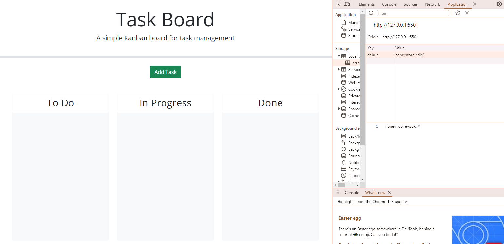
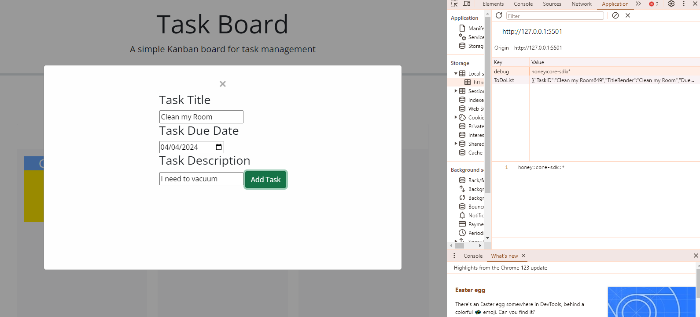
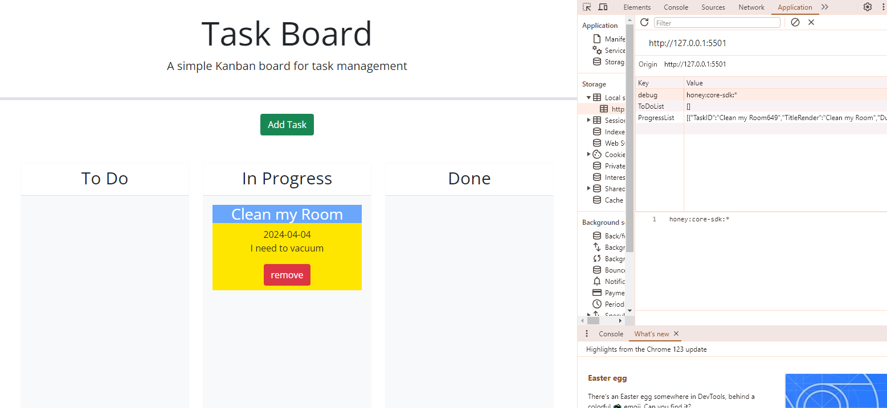
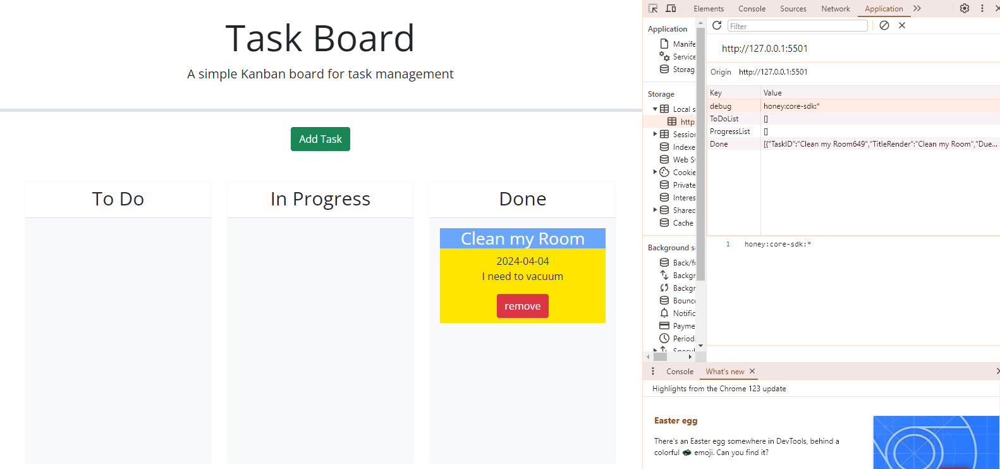
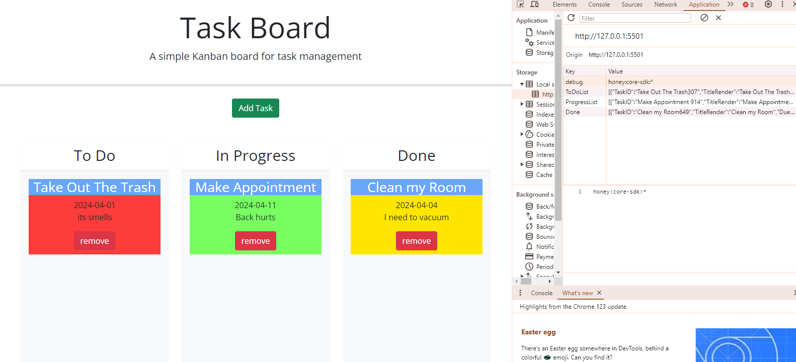
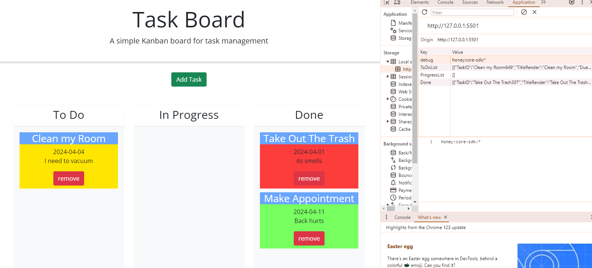

# User_Task_Board by Kendell Rennie

when nothing is added to any list

Now I haved added a Task and it is saved to localStorage

I have moved it from the ToDo List to In Progress and is reflected in localStorage 

Same for the Done List

you can add more Tasks

and rearrange them
